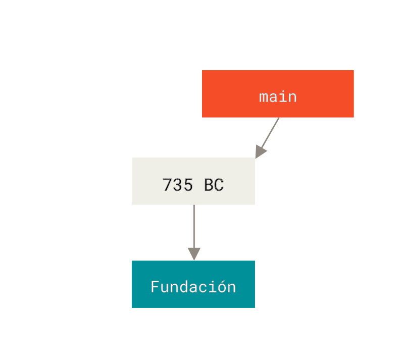
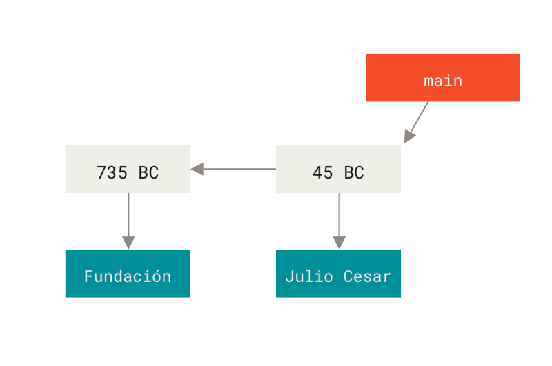
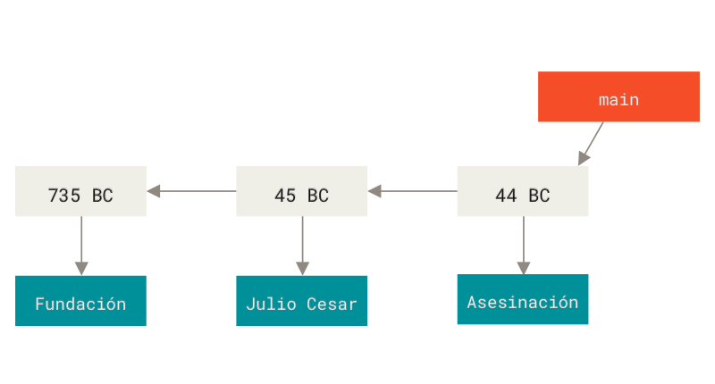
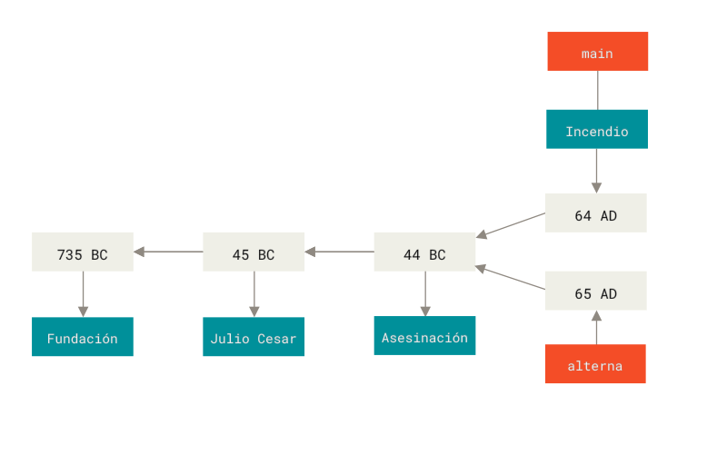

# ¿Qué es Git?

. . .

- Git y GitHub no son la misma cosa

- Git es un sistema de control de versiones

- Permite organizar diferentes versiones de un mismo archivo o todo un
  proyecto

- Permite colaborar con otras personas

## Qué es GitHub?

- GitHub es un servicio de almacenamiento. Como Drive

- Da otras cosas útiles como issues, pull requests, etc...

## Meme ilustrativo

{.stretch}

# Cómo funciona Git?

## Analogía con Roma

{.stretch}

## Julio Cesar se vuelve emperador

{.stretch}

## Brutus asesina a Julio Cesar

{.stretch}

## Bifurcación

{.stretch}

## Modelo distribuido

{.stretch}
