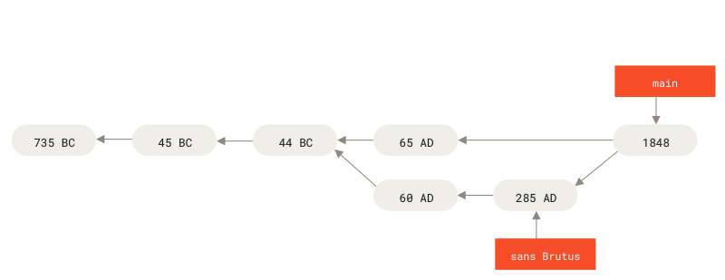

# ¿Qué es Git?

. . .

- Git y GitHub no son la misma cosa

- Git es un sistema de control de versiones

- Permite organizar diferentes versiones de un mismo archivo o todo un
  proyecto

- Permite colaborar con otras personas

## Qué es GitHub?

- GitHub es un servicio de almacenamiento. Como Drive

- Da otras cosas útiles como issues, pull requests, etc...

## Meme ilustrativo

{.stretch}

# Cómo funciona Git?

## Analogía con Roma

{.stretch}

## Julio Cesar se vuelve emperador

{.stretch}

## Brutus asesina a Julio Cesar

{.stretch}

## Bifurcación

{.stretch}

## Modelo distribuido

{.stretch}
# The Three States
Git tiene tres estados en los que puede estar un archivo en cualquier
momento dado:

::: incremental
 - **Modified**

 - **Staged / Preparado**

 - **Committed / Confirmado**
:::

. . .

1. Ignorados

## Tres etapas

Similarmente, hay tres secciones o “espacios” en cada proyecto de Git:

::: incremental
1. Working Directory.

2. Staging Area.

3. Git Repository.
:::
# Basic Git Workflow

::: incremental
1.  Modifica archivos locales en disco.

2.  Se elige qué archivos se desea rastrear (*track*) añadiéndolos al
	*staging area*.

	- Son estos y solo estos los archivos que serán parte del
	  siguiente commit

3. Se hace un _commit_ o confirmación
	- Esta versión queda guardada en el historial de cambios.
:::
# Básicos de Git
# Getting a Git Repository

Usualmente uno obtiene un repositorio de Git en dos maneras:

::: incremental
1. Se crea un repo con una carpeta existente, o bien.

2. *Clonas* un repositorio de Git existente de algún otro lugar.
:::

# ¿Cómo iniciar repo con carpeta existente?

. . .

## Inicializando un repo vacío.

```bash
$ git init
```

. . .

Señalando qué archivos rastrear. En este caso todos los de python.

```bash
$ git add *.py
```


## Notas

>  El comando `git add` tiene dos funciones: Cambia el estatus de
> un archivo de *untracked* a *tracked*, y además añade archivos
> *modified* al *staging area* para prepararlos para un *commit*.
>
> `add` recibe como argumento nombres de archivos, o patrones *glob*.

# Obteniendo un repo de un lugar remoto

Podemos hacer un _clon_ exacto de un proyecto con todo y su historial
de cambios.

## Clonando de algún lugar en internet

Dado un URL:

. . .

	$ git clone https://github.com/progit/progit2

Esto crea una nueva carpeta en tu current working directory con los
archivos del repo & el historial de cambios.
# Recording changes

Una vez que se tiene un repositorio de Git y archivos rastreados, se
puede empezar a usar todo el potencial de Git.

## Ciclo de vida de un archivo
{.stretch}

. . .

Para checar en qué punto del ciclo se encuentran los archivos existe el
comando `git status`.

## Checando estatus {.allowframebreaks}

:::incremental
- "working directory clean" significa que no hay cambios

- Veamos qué pasa al añadir un archivo

- Git reconoce el archivo, pero no rastreará sus cambios. Usamos...

- Un paso antes de confirmar
:::
# Commiting your changes

:::incremental
1. Guardar cambios en git con: `git commit`.
	- Es mejor siempre usar el modificador `-m`

2. El output da información interesante:
	- Nombre de rama. Aquí `main`.
	- Código alfanumérico llamado checksum
	- Estadísticas de cambios
:::

## Un pequeño atajo

Es común querer agregar todo lo modificado al staging area
directamente.

. . .

Combinamos modificadores `-m` con `-a` que es corto para `--all`.

	$ git commit -a -m "Fixes"

# Compartiendo con el mundo

El punto entero es trabajar con otras personas.

. . .

Recordamos el modelo distribuido anterior.

##

{.stretch}

. . .

En este caso GitHub será el remoto. (Server)

##

El comando push se contacta con el remoto.

	$ git push origin main

. . .

Toma 2 cosas:

- El nombre del remoto: `origin`
- El nombre de la "rama": `main`
# Viewing the Commit History

El punto entero de tener un sistema de control de versiones es poder
registrar cambios graduales

Para revisar el historial de cambios y confirmaciones existe el
comando `git log`. Vamos a correrlo.

##

Muestra un listado de commits en orden cronológico inverso e
información relevante de cada uno.

Algunos modificadores útiles:

:::incremental
- `-n` para mostrar los $n$ más recientes.
- `-p` cambios hechos por cada commit.
- `-stat` estadísticas descriptivas
:::
# Undoing things

De las cosas más útiles de usar git es que se pueden revertir cambios.
Algunos ejemplos prácticos

## Committeando antes de tiempo

. . .

	$ git commit --ammend -m "Mensaje"

Permite por ejemplo cambiar mensaje de confirmación

## Staging antes de tiempo

Para "bajar" un archivo del staging area

	$ git reset HEAD <archivo>

## Revertir un archivo al commit previo

. . .

	$ git checkout - <archivo>

. . .

> Precaución: No hay manera de revertir este cambio. Se reemplaza por
> completo al archivo con otra versión distinta.
# Working with remotes

Un remote es el servidor externo en el modelo distribuido.

. . .

Interactuamos con remotes a través de 3 comandos:

:::incremental.
- `pull`
- `push`
- `fech`
:::

## Listando remotes

	$ git remote -v

. . .

Si se clonó de GitHub verás el URL original. Si se inició con una
carpeta no habrá ningún remote configurado

. . .

Cuando se clona un repo se añade automáticamente un remote: `origin`.

. . .

Se pueden añadir remotes

	$ git remote add <shortname> <url>

## Pulling

Podemos _jalar_ (descargar) la versión de una rama específica de un
remoto específico.

	$ git pull <remote> <branch>

Pull no solo baja los contenidos, sino que los _mezcla_ con la rama
actual

. . .

Se puede descargar sin mezclar con fetch.

	$ git fetch origin main

Que crea una _rama_ nueva sin modificar tus archivos.

## Pushing

Se puede subir a GitHub con el comando `push`.

	$ git push <remote> <branch>

. . .

Para poder hacer push debes estar al día con `<branch>`

. . .

Más información de un remote con

	$ git remote show <remote>

## Tagging

Otra habilidad de Git es etiquetar (*tag*) *commit*s específicos

Permite ir clasificando por "versiones", como 1.0.x

. . .

Se listan los tags existentes con `git tag`.
# Git Branching

Las ramas permiten bifurcar el árbol de versiones.

##

{.stretch}

##

{.stretch}

##

{.stretch}

##

{.stretch}

##

{.stretch}

# Creando ramas

El comando para crear nuevas ramas es

    $ git branch <branchname>

El crear nuevas ramas implica solamente crear un nuevo apuntador, no
se mueve a una.

. . .

El apuntador especial `HEAD` indica a Git en qué punto se está
trabajando en un momento dado.

##

{.stretch}

## Moviéndonos a otra rama

Para cambiar de rama, es decir mover el apuntador `HEAD` para apuntar a
`testing` y empezar a hacer *commit* ahi, usamos el comando

    $ git checkout <branch>

# Basic Branching and Merging

Para unir dos ramas:

:::incremental
1. Checkout la rama receptora
2. `git merge <branch>`
3. Borrar `<branch>` (opcional)
:::

# Merge conflicts

Cuando intentas unir dos ramas con cambios divergentes, o a la que se
intenta unir no es ancestro directo de la que se une, Git no puede hacer
una unión *fast-forward*. En esos casos, Git tiene que hacer una unión
entre tres commits (*three-way merge*), que podemos pensar como nodos
sobre las ramas. Sin embargo, como los cambios en ambas ramas no
conflictúan entre sí, Git aún puede hacer una unión simple; es decir,
una que no requiere intervención del usuario. Cuando esto sucede, se
dice que no hay conflictos. En este caso particular, la unión se hace
entre los dos nodos usuales más un tercer nodo que es su ancestro común
más cercano.

Al unir dos ramas, Git combina los contenidos de manera automática (si
puede), y automáticamente crea un nuevo *commit*.

### Basic Merge Conflicts

Hay ocasiones en las que Git no puede hacer uniones simples y necesita
consultar con un usuario cuales cambios mantener. Estos conflictos se
dan cuando se intentan fusionar (unir) dos ramas que tienen cambios que
no son compatibles entre si. Por ejemplo, cuando se modifica un archivo
de dos maneras distintas en el mismo lugar con respecto a el ancestro en
común más cercano.

Un ejemplo de cuando no se puede hacer una unión limpia:

    $ git merge iss53
    Auto-merging index.html
    CONFLICT (content): Merge conflict in index.html
    Automatic merge failed; fix conflicts and then commit the result.

Cuando sucede un conflicto, Git pausa el proceso de unión que culmina
con un *commit* y espera a que el usuario resuelva los conflictos. Si
corremos `git status` después de un conflicto, podemos ver en qué
archivos se dió el conflicto para empezar a solucionarlo

    $git status
    On branch master
    You have unmerged paths.
      (fix conflicts and run "git commit")

    Unmerged paths:
      (use "git add <file>..." to mark resolution)

        both modified:      index.html

    no changes added to commit (use "git add" and/or "git commit -a")

En el ejemplo anterior el conflicto se dió en el archivo `index.html`.
Cuando ocurre un conflicto Git modifica los archivos y les añade
marcadores para ayudar a resolver el conflicto. Estos marcadores están
para que se pueda abrir manualmente el archivo, y decidir qué cambios se
quedan y cuales se van. Abriendo el archivo con conflicto, se vería algo
como esto:

    <<<<<<< HEAD:archivo.txt
    Contenido en HEAD. Es decir, rama local hacia la cual se hace la union
    =======
    Contenido en branch, rama que esta siendo unida a HEAD
    >>>>>>> branchname:archivo.txt

Entre los corchetes de apertura `<<<<<<<` y el separador `=======` están
los cambios que están en donde actualmente se encuentra `HEAD`. Es
decir, los cambios en la rama que está activada actualmente, hacia la
cual se quiere unir. En el encabezado se aclara en qué rama está, y el
archivo que tuvo conflictos. En la parte desde el separador hasta los
corchetes de cerradura `>>>>>>>` están los cambios *incoming*. Es decir,
los que están en la rama que se está tratando de unir.

Algunos editores de texto y IDEs están configurados para reconocer estos
bloques generados automáticamente por Git, y dan ayuda visual
poniendolos en fondos de colores, o dando botones de ayuda para aceptar
cambios *incoming*, mantener el estado actual, o incluso mantener ambos.
Si tu editor o IDE no tiene esta funcionalidad, puedes usar las
herramientas visuales que vienen con Git, corriendo `git mergetool`.

Para resolver un conflicto se eligen los cambios a mantener (o se borran
ambos), y se quitan los marcadores generados por Git. Una vez que se
decidió qué cambios mantener y se añade el archivo resuelto (sin
marcadores) al *Staging Area*, Git entenderá que el conflicto fue
resuelto. Si se corre `git status` en este punto Git pedirá confirmación
de que se resolvió exitosamente el conflicto. Para finalizar la unión se
confirman todos los cambios con `git commit`. Nótese que ahora no
escribimos un mensaje de confirmación, Git lo añade automáticamente con
la información más importante para señalizar que hubo una unión y
resolución de conflicto.

### Branch Management

El comando `git branch` al usarse sin argumentos va a listar todas las
ramas del repo, y marca la activa con un `*` al lado izquierdo de su
nombre. Para mostrar el *commit* más reciente en cada rama, se puede
usar `git branch -v`.

A veces es util ver si las ramas tienen cambios incorporados a la rama
actual, o si aún no se han unido. Para esto existen las opciones
`–merged` y `–no-merged` que actúan como filtro. Por ejemplo al correr

    $ git branch --merged
      mergedbranch
    * master

vemos que la rama `mergedbranch` ya fué unida a `master`. Como ya está
unida, es seguro eliminarla con `git branch -d mergedbranch` sin ningún
peligro. Sin embargo, si intentamos eliminar una rama que no ha sido
unida, digamos `unmerged-b`, Git nos dará un error y pedirá
confirmación.

    $ git branch -d unmerged-b
    error: The branch 'unmerged-b' is not fully merged.
    If you are sure you want to delete it, run 'git branch -D unmerged-b'.

Como muestra el mensaje de ayuda del comando anterior, se puede
sobreescribir el mecanismo de Git diseñado para no perder cambios usando
el switch `-D` (en mayúscula). Esto solo se hace si estás consciente de
que se perderán todos los cambios en esa rama. Por ejemplo, si era una
rama *throwaway* en la que se hizo un experimento.
# Basic Branching and Merging


El procedimiento básico para unir (*merge*) dos ramas es moverse, o
“activar” (*checkout*) la rama hacia la cual se va a unir, y correr el
comando `git merge <branch>`. Hay diferentes tipos de *merge*s que
pueden ocurrir. Cuando la rama que se unió estába directamente adelante,
sin cambios divergentes, Git lleva a cabo una unión *fast-forward*
(avance rápido). Es decir, Git simplemente mueve el apuntador `HEAD`
hacia adelante.

Si después de unir dos ramas ya no necesitas la que fue unida, la puedes
eliminar fácilmente con el comando `branch` y la opción `-d`, corto para
`–delete`

    $ git branch -d <branch>

Cuando intentas unir dos ramas con cambios divergentes, o a la que se
intenta unir no es ancestro directo de la que se une, Git no puede hacer
una unión *fast-forward*. En esos casos, Git tiene que hacer una unión
entre tres commits (*three-way merge*), que podemos pensar como nodos
sobre las ramas. Sin embargo, como los cambios en ambas ramas no
conflictúan entre sí, Git aún puede hacer una unión simple; es decir,
una que no requiere intervención del usuario. Cuando esto sucede, se
dice que no hay conflictos. En este caso particular, la unión se hace
entre los dos nodos usuales más un tercer nodo que es su ancestro común
más cercano.

Al unir dos ramas, Git combina los contenidos de manera automática (si
puede), y automáticamente crea un nuevo *commit*.

### Basic Merge Conflicts

Hay ocasiones en las que Git no puede hacer uniones simples y necesita
consultar con un usuario cuales cambios mantener. Estos conflictos se
dan cuando se intentan fusionar (unir) dos ramas que tienen cambios que
no son compatibles entre si. Por ejemplo, cuando se modifica un archivo
de dos maneras distintas en el mismo lugar con respecto a el ancestro en
común más cercano.

Un ejemplo de cuando no se puede hacer una unión limpia:

    $ git merge iss53
    Auto-merging index.html
    CONFLICT (content): Merge conflict in index.html
    Automatic merge failed; fix conflicts and then commit the result.

Cuando sucede un conflicto, Git pausa el proceso de unión que culmina
con un *commit* y espera a que el usuario resuelva los conflictos. Si
corremos `git status` después de un conflicto, podemos ver en qué
archivos se dió el conflicto para empezar a solucionarlo

    $git status
    On branch master
    You have unmerged paths.
      (fix conflicts and run "git commit")
    
    Unmerged paths:
      (use "git add <file>..." to mark resolution)
    
        both modified:      index.html
    
    no changes added to commit (use "git add" and/or "git commit -a")

En el ejemplo anterior el conflicto se dió en el archivo `index.html`.
Cuando ocurre un conflicto Git modifica los archivos y les añade
marcadores para ayudar a resolver el conflicto. Estos marcadores están
para que se pueda abrir manualmente el archivo, y decidir qué cambios se
quedan y cuales se van. Abriendo el archivo con conflicto, se vería algo
como esto:

    <<<<<<< HEAD:archivo.txt
    Contenido en HEAD. Es decir, rama local hacia la cual se hace la union
    =======
    Contenido en branch, rama que esta siendo unida a HEAD
    >>>>>>> branchname:archivo.txt

Entre los corchetes de apertura `<<<<<<<` y el separador `=======` están
los cambios que están en donde actualmente se encuentra `HEAD`. Es
decir, los cambios en la rama que está activada actualmente, hacia la
cual se quiere unir. En el encabezado se aclara en qué rama está, y el
archivo que tuvo conflictos. En la parte desde el separador hasta los
corchetes de cerradura `>>>>>>>` están los cambios *incoming*. Es decir,
los que están en la rama que se está tratando de unir.

Algunos editores de texto y IDEs están configurados para reconocer estos
bloques generados automáticamente por Git, y dan ayuda visual
poniendolos en fondos de colores, o dando botones de ayuda para aceptar
cambios *incoming*, mantener el estado actual, o incluso mantener ambos.
Si tu editor o IDE no tiene esta funcionalidad, puedes usar las
herramientas visuales que vienen con Git, corriendo `git mergetool`.

Para resolver un conflicto se eligen los cambios a mantener (o se borran
ambos), y se quitan los marcadores generados por Git. Una vez que se
decidió qué cambios mantener y se añade el archivo resuelto (sin
marcadores) al *Staging Area*, Git entenderá que el conflicto fue
resuelto. Si se corre `git status` en este punto Git pedirá confirmación
de que se resolvió exitosamente el conflicto. Para finalizar la unión se
confirman todos los cambios con `git commit`. Nótese que ahora no
escribimos un mensaje de confirmación, Git lo añade automáticamente con
la información más importante para señalizar que hubo una unión y
resolución de conflicto.

### Branch Management

El comando `git branch` al usarse sin argumentos va a listar todas las
ramas del repo, y marca la activa con un `*` al lado izquierdo de su
nombre. Para mostrar el *commit* más reciente en cada rama, se puede
usar `git branch -v`.

A veces es util ver si las ramas tienen cambios incorporados a la rama
actual, o si aún no se han unido. Para esto existen las opciones
`–merged` y `–no-merged` que actúan como filtro. Por ejemplo al correr

    $ git branch --merged
      mergedbranch
    * master

vemos que la rama `mergedbranch` ya fué unida a `master`. Como ya está
unida, es seguro eliminarla con `git branch -d mergedbranch` sin ningún
peligro. Sin embargo, si intentamos eliminar una rama que no ha sido
unida, digamos `unmerged-b`, Git nos dará un error y pedirá
confirmación.

    $ git branch -d unmerged-b
    error: The branch 'unmerged-b' is not fully merged.
    If you are sure you want to delete it, run 'git branch -D unmerged-b'.

Como muestra el mensaje de ayuda del comando anterior, se puede
sobreescribir el mecanismo de Git diseñado para no perder cambios usando
el switch `-D` (en mayúscula). Esto solo se hace si estás consciente de
que se perderán todos los cambios en esa rama. Por ejemplo, si era una
rama *throwaway* en la que se hizo un experimento.
# Branching Workflows


En esta subsección revisamos algunos de los *workflows* más comunes que
se usan para trabajar con Git y ramas. Esto es en realidad más
descriptivo que normativo, pero es útil para estructurar proyectos
grandes. En especial porque estos *workflows* están diseñados para
evitar conflictos a la hora de las uniones, y tener tantas uniones
simples como sea posible.

### Long-Running Branches

La estructura de desarrollo de ramas *long-running* se basa en tener un
número pequeño de ramas principales que siempre están abiertas,
dedicadas a las diferentes etapas del desarrollo, las cuales se unen
entre si de manera regular.

Una estrategia común es tener dos ramas principales: *master* y
*development* (los nombres no son importantes). En `master` se tiene el
código en su estado más pulido, mientras que en `development` se hacen
los cambios importantes que solo se unen a `master` una vez que están
terminados, probados, etc… Es usual agregar una rama o serie de ramas
más dedicadas a resolver problemas particulares. Estas ramas se unen a
`development` una vez que se resolvió aquello para lo cual fueron
creadas, y se eliminan poco después. Este tipo de ramas se conocen como
*topic branches*, o ramas de tema.

Es útil pensar en las ramas estructuradas de esta manera como almacenes
en los que se guarda código en función de su madurez.
# Rebasing


Como el nombre sugiere, consiste en cambiar de base una versión
particular. Es decir, es como hacer los cambios que se efectuaron a
través de una rama, como si se hubieran hecho empezando desde otro
punto de la rama o de otra rama por completo.

    $ git rebase master

La operación funciona encontrando al ancestro común de las dos ramas que
se están uniendo, y aplicando lo cambios gradualmente. Una vez que se
hace un *rebase*, se puede hacer un *merge* simple del tipo
*fast-forward* hasta la punta de la rama. Todo eso gracias a que ahora
la punta de la rama y el *commit* al que se hizo el *rebase* tienen una
ancestría en común, una ancestría lineal. Ya no hay ningún conflicto de
versiones.

Vale la pena hacer notar que el producto final no tiene nada de
diferente a hacer un *merge*. La única ventaja notable es que hace que
la historia de *commits*, los logs, esté más limpio y claro.

Hay *rebases* más complejos, pero francamente no entendí del todo, y
valdrá la pena revisarlo con más calma.

### No incluí los cambios que quería en un commit anterior. ¿Ahora qué hago?

Ua buena aplicación del rebasing es justo en la situación del título.
¿Qué tal si yo tenía planeado incluir los cambios a el archivo
`ìndex.txt` en un commit que hice con el mensaje “Cambios a index.txt”,
pero me equivoqué y no añadí `index.txt` al *staging area* antes de ese
commit?

En concreto: Consideremos el log de cambios de un repo:

    a0b0c0E3 (HEAD -> master) Cambios que no eran de index.txt
    .
    .
    .
    a0b0c0E1 Cambios a index.txt

Digamos que yo quería incluir los cambios a `index.txt` en el commit con
hash `a0b0c0E1`, pero al correr `git status` me señala que los cambios
no están “staged for commit” para el siguiente commit y por lo tanto no
se añadieron antes. Para volver a antes de `a0b0c0E1` y ahora si añadir
los cambios en ese commit, podemos usar rebase como en la siguiente
receta:

1.  `git rebase –interactive ’a0b0c0E1^’`. Nótese que el hash del commit
    al que nos estamos refiriendo está postfijo por un “caret” (^). Eso
    indica rebase no a `a0b0c0E1`, sino *antes* de el.

2.  En el editor predeterminado se abrirá un archivo que se ve más o
    menos asi:
    
        pick a0b0c0E3 HEAD Cambios que no eran de index.txt
        pick a0b0c0E1 Cambios a index.txt
    
    Cambia `pick` a `edit` en la línea que tiene el chash del commit el
    cual deseas modificar o añadirle archivos. Guarda el archivo y
    ciérralo.

3.  Después de los pasos anteriores, Git marca al commit `a0b0c0E1` como
    el actual (donde se encuentra `HEAD`), y por lo tanto se le pueden
    añadir cambios con ammend. Por ejemplo:
    
        git add index.txt
        git commit --amend -m "Ahora si, cambios a index.txt"

4.  Para acabar y volver a la punta de la rama actual, es decir donde
    estábamos antes, seguimos el consejo de Git y corremos `git rebase
    –continue`.# Distributed workflows
