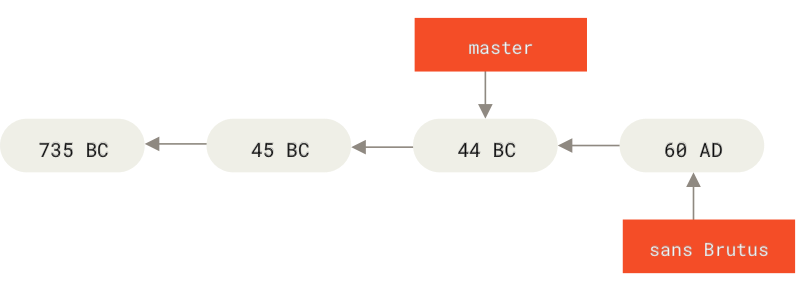
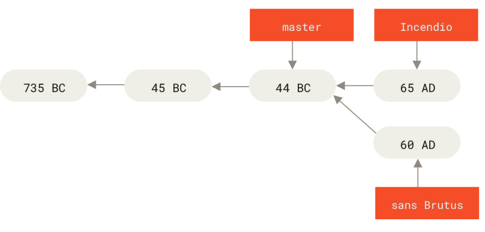

# Git Branching

Las ramas permiten bifurcar el árbol de versiones.

##

{.stretch}

##

{.stretch}

##

{.stretch}

##

{.stretch}

##

{.stretch}

# Creando ramas

El comando para crear nuevas ramas es

    $ git branch <branchname>

El crear nuevas ramas implica solamente crear un nuevo apuntador, no
se mueve a una.

. . .

El apuntador especial `HEAD` indica a Git en qué punto se está
trabajando en un momento dado.

##

{.stretch}

## Moviéndonos a otra rama

Para cambiar de rama, es decir mover el apuntador `HEAD` para apuntar a
`testing` y empezar a hacer *commit* ahi, usamos el comando

    $ git checkout <branch>

# Basic Branching and Merging

Para unir dos ramas:

:::incremental
1. Checkout la rama receptora
2. `git merge <branch>`
3. Borrar `<branch>` (opcional)
:::

# Merge conflicts

Cuando intentas unir dos ramas con cambios divergentes, o a la que se
intenta unir no es ancestro directo de la que se une, Git no puede hacer
una unión *fast-forward*. En esos casos, Git tiene que hacer una unión
entre tres commits (*three-way merge*), que podemos pensar como nodos
sobre las ramas. Sin embargo, como los cambios en ambas ramas no
conflictúan entre sí, Git aún puede hacer una unión simple; es decir,
una que no requiere intervención del usuario. Cuando esto sucede, se
dice que no hay conflictos. En este caso particular, la unión se hace
entre los dos nodos usuales más un tercer nodo que es su ancestro común
más cercano.

Al unir dos ramas, Git combina los contenidos de manera automática (si
puede), y automáticamente crea un nuevo *commit*.

### Basic Merge Conflicts

Hay ocasiones en las que Git no puede hacer uniones simples y necesita
consultar con un usuario cuales cambios mantener. Estos conflictos se
dan cuando se intentan fusionar (unir) dos ramas que tienen cambios que
no son compatibles entre si. Por ejemplo, cuando se modifica un archivo
de dos maneras distintas en el mismo lugar con respecto a el ancestro en
común más cercano.

Un ejemplo de cuando no se puede hacer una unión limpia:

    $ git merge iss53
    Auto-merging index.html
    CONFLICT (content): Merge conflict in index.html
    Automatic merge failed; fix conflicts and then commit the result.

Cuando sucede un conflicto, Git pausa el proceso de unión que culmina
con un *commit* y espera a que el usuario resuelva los conflictos. Si
corremos `git status` después de un conflicto, podemos ver en qué
archivos se dió el conflicto para empezar a solucionarlo

    $git status
    On branch master
    You have unmerged paths.
      (fix conflicts and run "git commit")

    Unmerged paths:
      (use "git add <file>..." to mark resolution)

        both modified:      index.html

    no changes added to commit (use "git add" and/or "git commit -a")

En el ejemplo anterior el conflicto se dió en el archivo `index.html`.
Cuando ocurre un conflicto Git modifica los archivos y les añade
marcadores para ayudar a resolver el conflicto. Estos marcadores están
para que se pueda abrir manualmente el archivo, y decidir qué cambios se
quedan y cuales se van. Abriendo el archivo con conflicto, se vería algo
como esto:

    <<<<<<< HEAD:archivo.txt
    Contenido en HEAD. Es decir, rama local hacia la cual se hace la union
    =======
    Contenido en branch, rama que esta siendo unida a HEAD
    >>>>>>> branchname:archivo.txt

Entre los corchetes de apertura `<<<<<<<` y el separador `=======` están
los cambios que están en donde actualmente se encuentra `HEAD`. Es
decir, los cambios en la rama que está activada actualmente, hacia la
cual se quiere unir. En el encabezado se aclara en qué rama está, y el
archivo que tuvo conflictos. En la parte desde el separador hasta los
corchetes de cerradura `>>>>>>>` están los cambios *incoming*. Es decir,
los que están en la rama que se está tratando de unir.

Algunos editores de texto y IDEs están configurados para reconocer estos
bloques generados automáticamente por Git, y dan ayuda visual
poniendolos en fondos de colores, o dando botones de ayuda para aceptar
cambios *incoming*, mantener el estado actual, o incluso mantener ambos.
Si tu editor o IDE no tiene esta funcionalidad, puedes usar las
herramientas visuales que vienen con Git, corriendo `git mergetool`.

Para resolver un conflicto se eligen los cambios a mantener (o se borran
ambos), y se quitan los marcadores generados por Git. Una vez que se
decidió qué cambios mantener y se añade el archivo resuelto (sin
marcadores) al *Staging Area*, Git entenderá que el conflicto fue
resuelto. Si se corre `git status` en este punto Git pedirá confirmación
de que se resolvió exitosamente el conflicto. Para finalizar la unión se
confirman todos los cambios con `git commit`. Nótese que ahora no
escribimos un mensaje de confirmación, Git lo añade automáticamente con
la información más importante para señalizar que hubo una unión y
resolución de conflicto.

### Branch Management

El comando `git branch` al usarse sin argumentos va a listar todas las
ramas del repo, y marca la activa con un `*` al lado izquierdo de su
nombre. Para mostrar el *commit* más reciente en cada rama, se puede
usar `git branch -v`.

A veces es util ver si las ramas tienen cambios incorporados a la rama
actual, o si aún no se han unido. Para esto existen las opciones
`–merged` y `–no-merged` que actúan como filtro. Por ejemplo al correr

    $ git branch --merged
      mergedbranch
    * master

vemos que la rama `mergedbranch` ya fué unida a `master`. Como ya está
unida, es seguro eliminarla con `git branch -d mergedbranch` sin ningún
peligro. Sin embargo, si intentamos eliminar una rama que no ha sido
unida, digamos `unmerged-b`, Git nos dará un error y pedirá
confirmación.

    $ git branch -d unmerged-b
    error: The branch 'unmerged-b' is not fully merged.
    If you are sure you want to delete it, run 'git branch -D unmerged-b'.

Como muestra el mensaje de ayuda del comando anterior, se puede
sobreescribir el mecanismo de Git diseñado para no perder cambios usando
el switch `-D` (en mayúscula). Esto solo se hace si estás consciente de
que se perderán todos los cambios en esa rama. Por ejemplo, si era una
rama *throwaway* en la que se hizo un experimento.
